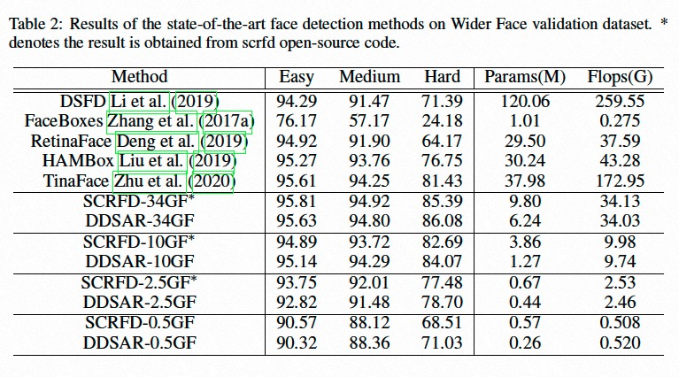

<div align="center">
  
</div>
<h4 align="center">
    <a href=#DamoFD模型介绍> 模型介绍 </a> |
    <a href=#快速使用> 快速使用 </a> |
    <a href=#单图片推理> 单图片推理 </a> | 
    <a href=#多图片推理和评测> 多图片推理/评测 </a> |
    <a href=#模型训练> 模型训练 </a> | 
    <a href=#模型微调> 模型微调 </a> 
</h4>

# DamoFD模型介绍
人脸检测关键点模型DamoFD，被ICLR2023录取([论文地址](https://openreview.net/forum?id=NkJOhtNKX91)), 这个项目中开源的模型是在DamoFD增加了关键点分支，论文原文代码见[项目地址](https://github.com/ly19965/DamoFD)，论文解析详见[解析]()。

## 快速使用

DamoFD为当前SOTA的人脸检测关键点方法，论文已被ICLR23录取([论文地址](https://openreview.net/forum?id=NkJOhtNKX91))。DamoFD提供了family-based 人脸检测关键点模型，分别为`DamoFD-0.5G, DamoFD-2.5G, DamoFD-10G, DamoFD-34G`，性能均明显超过[SCRFD](https://arxiv.org/abs/2105.04714)。在这个界面中，我们提供几个有关`推理/评测/训练/微调`脚本帮助大家迅速/一键使用DamoFD, 代码范例中的实例均集成在如下几个unit test脚本里：
- `DamoFD-0.5G: 训练，微调`：train_damofd_500m.py; 推理，评测：test_damofd_500m.py
- `DamoFD-2.5G: 训练，微调`：train_damofd_2500m.py; 推理，评测：test_damofd_2500m.py
- `DamoFD-10G: 训练，微调`：train_damofd_10g.py; 推理，评测：test_damofd_10g.py
- `DamoFD-34G: 训练，微调`：train_damofd_34g.py; 推理，评测：test_damofd_34g.py
- `Usage on DamoFD-0.5G`: 
```python
PYTHONPATH=. python face_project/face_detection/DamoFD/train_damofd_500m.py
PYTHONPATH=. python face_project/face_detection/DamoFD/test_damofd_500m.py
```

## 代码范例
我们以DamoFD-0.5G为例，提供了推理/评测/训练/微调代码范例和解析:

### 单图片推理
```python
import cv2
from modelscope.pipelines import pipeline
from modelscope.utils.constant import  Tasks

face_detection = pipeline(task=Tasks.face_detection, model='damo/cv_ddsar_face-detection_iclr23-damofd')
# 支持 url image and abs dir image path
img_path = 'https://modelscope.oss-cn-beijing.aliyuncs.com/test/images/face_detection2.jpeg' 
result = face_detection(img_path)

# 提供可视化结果
from modelscope.utils.cv.image_utils import draw_face_detection_result
from modelscope.preprocessors.image import LoadImage
img = LoadImage.convert_to_ndarray(img_path)
cv2.imwrite('srcImg.jpg', img)
img_draw = draw_face_detection_result('srcImg.jpg', result)
import matplotlib.pyplot as plt
plt.imshow(img_draw)
```

### 多图片推理和评测
- 我们提供了100张测试图片，可运行下面代码一键使用（下载数据集+推理）；
- 也支持测试自建数据集，需要按如下格式建立数据集:
```
img_base_path/
    val_data/
        test_1.jpg
        ...
        test_N.jpg
    val_label.txt 
    ## val_label.txt format
    test_1.jpg
    x0 x1 w h 
    x0 x1 w h 
    ...
    test_N.jpg
    x0 x1 w h 
    x0 x1 w h 
    ...
```

```python
import os.path as osp
import cv2
import os
import numpy as np
import torch
from modelscope.msdatasets import MsDataset
from modelscope.pipelines import pipeline
from modelscope.utils.constant import Tasks
from modelscope.utils.cv.image_utils import voc_ap, image_eval,img_pr_info, gen_gt_info, dataset_pr_info, bbox_overlap

model_id = 'damo/cv_ddsar_face-detection_iclr23-damofd'
val_set = MsDataset.load('widerface_mini_train_val', namespace='ly261666', split='validation')#, download_mode=DownloadMode.FORCE_REDOWNLOAD)
img_base_path = next(iter(val_set))[1]
img_dir = osp.join(img_base_path, 'val_data')
img_gt = osp.join(img_base_path, 'val_label.txt')
gt_info = gen_gt_info(img_gt)
pred_info = {}
iou_th = 0.5
thresh_num = 1000
count_face = 0
pr_curve = np.zeros((thresh_num, 2)).astype('float')

#ft_path = '/tmp/tmpoyakm4k4/epoch_641.pth'

for img_name in os.listdir(img_dir):
    abs_img_name = osp.join(img_dir, img_name)
    face_detection_func = pipeline(Tasks.face_detection, model=model_id)

    #face_detection_func.model.detector.module.load_state_dict(torch.load(ft_path)['state_dict'])

    result = face_detection_func(abs_img_name)
    if len(result['boxes']) == 0:
        pred_info = np.array([[0,0,0,0,0]]) 
    else:
        pred_info = np.concatenate([result['boxes'], np.array(result['scores'])[:,np.newaxis]], axis=1)
    gt_box = np.array(gt_info[img_name])
    pred_recall, proposal_list = image_eval(pred_info, gt_box, iou_th)
    _img_pr_info, fp = img_pr_info(thresh_num, pred_info, proposal_list, pred_recall)
    pr_curve += _img_pr_info
    count_face += gt_box.shape[0]

pr_curve = dataset_pr_info(thresh_num, pr_curve, count_face)
propose = pr_curve[:, 0]
recall = pr_curve[:, 1]
for srecall in np.arange(0.1, 1.0001, 0.1):
    rindex = len(np.where(recall<=srecall)[0])-1
    rthresh = 1.0 - float(rindex)/thresh_num
    print('Recall-Precision-Thresh:', recall[rindex], propose[rindex], rthresh)
ap = voc_ap(recall, propose)
print('ap: %.5f, iou_th: %.2f'%(ap, iou_th))
```
Result:
```
Recall-Precision-Thresh: 0.09902038655017209 1.0 0.746
Recall-Precision-Thresh: 0.19989409584326184 0.993421052631579 0.632
Recall-Precision-Thresh: 0.2991792427852793 0.9519797809604044 0.499
Recall-Precision-Thresh: 0.39925867090283296 0.8308539944903581 0.367
Recall-Precision-Thresh: 0.4495631453534551 0.7237851662404092 0.0010000000000000009
Recall-Precision-Thresh: 0.4495631453534551 0.7237851662404092 0.0010000000000000009
Recall-Precision-Thresh: 0.4495631453534551 0.7237851662404092 0.0010000000000000009
Recall-Precision-Thresh: 0.4495631453534551 0.7237851662404092 0.0010000000000000009
Recall-Precision-Thresh: 0.4495631453534551 0.7237851662404092 0.0010000000000000009
Recall-Precision-Thresh: 0.4495631453534551 0.7237851662404092 0.0010000000000000009
ap: 0.42606, iou_th: 0.50
```

### 模型训练
- 我们提供了Wider Face 和 Wider Face mini的训练集，可运行下面代码一键使用（下载数据集+训练）；
- 也支持训练自建数据集，需要按如下格式建立数据集:
```
# <image_path> image_width image_height
bbox_x1 bbox_y1 bbox_x2 bbox_y2 (<keypoint,3>*N)
...
...
# <image_path> image_width image_height
bbox_x1 bbox_y1 bbox_x2 bbox_y2 (<keypoint,3>*N)
...
...
```

```python
import os
import tempfile
from modelscope.msdatasets import MsDataset
from modelscope.metainfo import Trainers
from modelscope.trainers import build_trainer
from modelscope.hub.snapshot_download import snapshot_download

model_id = 'damo/cv_ddsar_face-detection_iclr23-damofd'
ms_ds_widerface = MsDataset.load('WIDER_FACE_mini', namespace='shaoxuan')  # remove '_mini' for full dataset

data_path = ms_ds_widerface.config_kwargs['split_config']
train_dir = data_path['train']
val_dir = data_path['validation']

def get_name(dir_name):
    names = [i for i in os.listdir(dir_name) if not i.startswith('_')]
    return names[0]

train_root = train_dir + '/' + get_name(train_dir) + '/'
val_root = val_dir + '/' + get_name(val_dir) + '/'
cache_path = snapshot_download(model_id)
tmp_dir = tempfile.TemporaryDirectory().name
if not os.path.exists(tmp_dir):
    os.makedirs(tmp_dir)

def _cfg_modify_fn(cfg):
    cfg.checkpoint_config.interval = 1
    cfg.log_config.interval = 10
    cfg.evaluation.interval = 1
    cfg.data.workers_per_gpu = 1
    cfg.data.samples_per_gpu = 4
    return cfg

kwargs = dict(
    cfg_file=os.path.join(cache_path, 'DamoFD_lms.py'),
    work_dir=tmp_dir,
    train_root=train_root,
    val_root=val_root,
    total_epochs=1,  # run #epochs
    cfg_modify_fn=_cfg_modify_fn)

trainer = build_trainer(name=Trainers.face_detection_scrfd, default_args=kwargs)
trainer.train()
```

### 模型微调
- 我们提供了Wider Face 和 Wider Face mini的训练集，可运行下面代码一键使用（下载数据集+训练）；
- 网络结构在'modelscope/modelscope/models/cv/face_detection/scrfd/damofd_detect.py', 训练细节在'trainers/cv/face_detection_scrfd_trainer.py'。可以修改这两个文件中的
- 也支持微调自建数据集，需要按如下格式建立数据集:
```
# <image_path> image_width image_height
bbox_x1 bbox_y1 bbox_x2 bbox_y2 (<keypoint,3>*N)
...
...
# <image_path> image_width image_height
bbox_x1 bbox_y1 bbox_x2 bbox_y2 (<keypoint,3>*N)
...
...
```

```python
import os
import tempfile
from modelscope.msdatasets import MsDataset
from modelscope.metainfo import Trainers
from modelscope.trainers import build_trainer
from modelscope.hub.snapshot_download import snapshot_download
from modelscope.utils.constant import ModelFile

model_id = 'damo/cv_ddsar_face-detection_iclr23-damofd'
ms_ds_widerface = MsDataset.load('WIDER_FACE_mini', namespace='shaoxuan')  # remove '_mini' for full dataset

data_path = ms_ds_widerface.config_kwargs['split_config']
train_dir = data_path['train']
val_dir = data_path['validation']

def get_name(dir_name):
    names = [i for i in os.listdir(dir_name) if not i.startswith('_')]
    return names[0]

train_root = train_dir + '/' + get_name(train_dir) + '/'
val_root = val_dir + '/' + get_name(val_dir) + '/'
cache_path = snapshot_download(model_id)
tmp_dir = tempfile.TemporaryDirectory().name
pretrain_epochs = 640
ft_epochs = 1
total_epochs = pretrain_epochs + ft_epochs
if not os.path.exists(tmp_dir):
    os.makedirs(tmp_dir)

def _cfg_modify_fn(cfg):
    cfg.checkpoint_config.interval = 1
    cfg.log_config.interval = 10
    cfg.evaluation.interval = 1
    cfg.data.workers_per_gpu = 1
    cfg.data.samples_per_gpu = 4
    return cfg

kwargs = dict(
    cfg_file=os.path.join(cache_path, 'DamoFD_lms.py'),
    work_dir=tmp_dir,
    train_root=train_root,
    val_root=val_root,
    resume_from=os.path.join(cache_path, ModelFile.TORCH_MODEL_FILE),
    total_epochs=total_epochs,  # run #epochs
    cfg_modify_fn=_cfg_modify_fn)

trainer = build_trainer(name=Trainers.face_detection_scrfd, default_args=kwargs)
trainer.train()
```


## 模型效果


<!---
## 引用
如果你觉得这个该模型对有所帮助，请考虑引用下面的相关的论文：

```BibTeX
@inproceedings{liu2022mogface,
      title={MogFace: Towards a Deeper Appreciation on Face Detection},
        author={Liu, Yang and Wang, Fei and Deng, Jiankang and Zhou, Zhipeng and Sun, Baigui and Li, Hao},
          booktitle={Proceedings of the IEEE/CVF Conference on Computer Vision and Pattern Recognition},
            pages={4093--4102},
              year={2022}
}
```
-->

