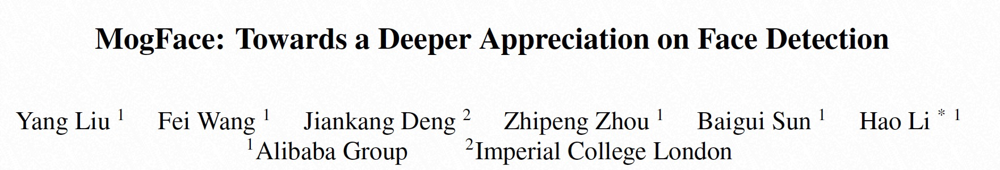
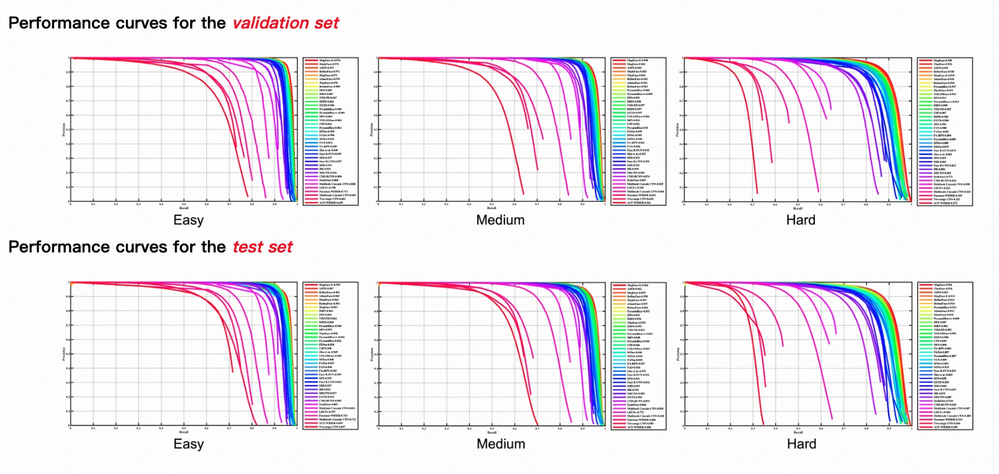

<div align="center">
  
</div>
<h4 align="center">
    <a href=#MogFace模型介绍> 模型介绍 </a> |
    <a href=#快速使用> 快速使用 </a> |
    <a href=#单图片推理> 单图片推理 </a> | 
    <a href=#多图片推理和评测> 多图片推理/评测 </a> 
</h4>

# MogFace模型介绍
MogFace为当前SOTA的人脸检测方法，已在Wider Face六项榜单上霸榜一年以上，后续被CVPR2022录取([论文地址](https://openaccess.thecvf.com/content/CVPR2022/papers/Liu_MogFace_Towards_a_Deeper_Appreciation_on_Face_Detection_CVPR_2022_paper.pdf))，该方法的主要贡献是从下面三个角度提升人脸检测器：
- Scale-level Data Augmentation (SSE)：SSE是第一个从maximize pyramid layer 表征的角度来控制数据集中gt的尺度分布，而不是intuitive的假想检测器的学习能力，因此会在不同场景下都很鲁棒。
- Adaptive Online Anchor Mining Strategy(Ali-AMS)：减少对超参的依赖， 简单且有效的adpative label assign 方法。
- Hierarchical Context-aware Module (HCAM)： 减少误检是real world人脸检测器面对的最大挑战，HCAM是最近几年第一次在算法侧给出solid solution。

## 快速使用

在这个界面中，我们提供几个有关`推理/评测`脚本帮助大家迅速/一键使用MogFace, 代码范例中的实例均集成在test_mog_face_detection.py
- `Usage`:
```python
PYTHONPATH=. python face_project/face_detection/MogFace/test_mog_face_detection.py
```

## 代码范例

### 单图片推理
```python
import cv2
from modelscope.pipelines import pipeline
from modelscope.utils.constant import  Tasks

face_detection = pipeline(task=Tasks.face_detection, model='damo/cv_resnet101_face-detection_cvpr22papermogface')
# 支持 url image and abs dir image path
img_path = 'https://modelscope.oss-cn-beijing.aliyuncs.com/test/images/face_detection2.jpeg' 
result = face_detection(img_path)

# 提供可视化结果
from modelscope.utils.cv.image_utils import draw_face_detection_result
from modelscope.preprocessors.image import LoadImage
img = LoadImage.convert_to_ndarray(img_path)
cv2.imwrite('srcImg.jpg', img)
img_draw = draw_face_detection_result('srcImg.jpg', result)
import matplotlib.pyplot as plt
plt.imshow(img_draw)
```

### 多图片推理和评测
- 我们提供了100张测试图片，可运行下面代码一键使用（下载数据集+推理）；
- 也支持测试自建数据集，需要按如下格式建立数据集:
```
img_base_path/
    val_data/
        test_1.jpg
        ...
        test_N.jpg
    val_label.txt 
    ## val_label.txt format
    test_1.jpg
    x0 x1 w h 
    x0 x1 w h 
    ...
    test_N.jpg
    x0 x1 w h 
    x0 x1 w h 
    ...
```

```python
import os.path as osp
import cv2
import os
import numpy as np
from modelscope.msdatasets import MsDataset
from modelscope.pipelines import pipeline
from modelscope.utils.constant import Tasks
from modelscope.utils.cv.image_utils import voc_ap, image_eval,img_pr_info, gen_gt_info, dataset_pr_info, bbox_overlap

model_id = 'damo/cv_resnet101_face-detection_cvpr22papermogface'
val_set = MsDataset.load('widerface_mini_train_val', namespace='ly261666', split='validation')#, download_mode=DownloadMode.FORCE_REDOWNLOAD)
img_base_path = next(iter(val_set))[1]
img_dir = osp.join(img_base_path, 'val_data')
img_gt = osp.join(img_base_path, 'val_label.txt')
gt_info = gen_gt_info(img_gt)
pred_info = {}
iou_th = 0.5
thresh_num = 1000
face_detection_func = pipeline(Tasks.face_detection, model=self.model_id, conf_th=0.01)
count_face = 0
pr_curve = np.zeros((thresh_num, 2)).astype('float')
for img_name in os.listdir(img_dir):
    print ('inference img: {} {}/{}'.format(img_name, idx+1, len(os.listdir(img_dir))))
    abs_img_name = osp.join(img_dir, img_name)
    result = face_detection_func(abs_img_name)
    pred_info = np.concatenate([result['boxes'], np.array(result['scores'])[:,np.newaxis]], axis=1)
    gt_box = np.array(gt_info[img_name])
    pred_recall, proposal_list = image_eval(pred_info, gt_box, iou_th)
    _img_pr_info, fp = img_pr_info(thresh_num, pred_info, proposal_list, pred_recall)
    pr_curve += _img_pr_info
    count_face += gt_box.shape[0]
    
pr_curve = dataset_pr_info(thresh_num, pr_curve, count_face)
propose = pr_curve[:, 0]
recall = pr_curve[:, 1]
for srecall in np.arange(0.1, 1.0001, 0.1):
    rindex = len(np.where(recall<=srecall)[0])-1
    rthresh = 1.0 - float(rindex)/thresh_num
    print('Recall-Precision-Thresh:', recall[rindex], propose[rindex], rthresh)
ap = voc_ap(recall, propose)
print('ap: %.5f, iou_th: %.2f'%(ap, iou_th))
```
Result:
```
Recall-Precision-Thresh: 0.09928514694201747 1.0 0.914
Recall-Precision-Thresh: 0.19962933545141648 0.9986754966887417 0.841
Recall-Precision-Thresh: 0.29864972200158857 0.9964664310954063 0.749
Recall-Precision-Thresh: 0.39899391051098754 0.9947194719471947 0.6619999999999999
Recall-Precision-Thresh: 0.4996028594122319 0.9823008849557522 0.565
Recall-Precision-Thresh: 0.598623245962404 0.9548141891891891 0.471
Recall-Precision-Thresh: 0.6997617156473391 0.9091847265221878 0.384
Recall-Precision-Thresh: 0.7995763833730474 0.8055481461723126 0.274
Recall-Precision-Thresh: 0.8988615303150649 0.05734797297297297 0.0010000000000000009
Recall-Precision-Thresh: 0.8988615303150649 0.05734797297297297 0.0010000000000000009
ap: 0.83243, iou_th: 0.50
```

## 模型精度


## 来源说明
本模型及代码来自达摩院自研技术

## 引用
如果你觉得这个该模型对有所帮助，请考虑引用下面的相关的论文：

```BibTeX
@inproceedings{liu2022mogface,
      title={MogFace: Towards a Deeper Appreciation on Face Detection},
        author={Liu, Yang and Wang, Fei and Deng, Jiankang and Zhou, Zhipeng and Sun, Baigui and Li, Hao},
          booktitle={Proceedings of the IEEE/CVF Conference on Computer Vision and Pattern Recognition},
            pages={4093--4102},
              year={2022}
}
```

