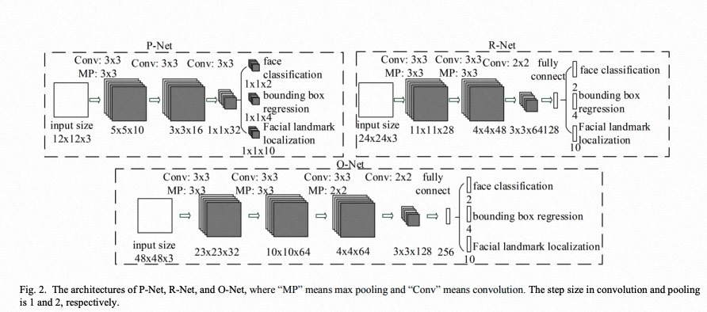

<div align="center">
  
</div>
<h4 align="center">
    <a href=#Mtcnn模型介绍> 模型介绍 </a> |
    <a href=#快速使用> 快速使用 </a> |
    <a href=#单图片推理> 单图片推理 </a> | 
    <a href=#多图片推理和评测> 多图片推理/评测 </a> 
</h4>

# Mtcnn模型介绍
MTCNN是工业界广泛应用的检测关键点二合一模型, ([论文地址](https://arxiv.org/abs/1604.02878), [代码地址](https://github.com/TropComplique/mtcnn-pytorch))，该方法包含下面4个模块:
- Image Pyramid: 首先将图像进行不同尺度的变换，构建图像金字塔，以适应不同大小的人脸的进行检测;
- Proposal Network: 其基本的构造是一个全卷积网络。对上一步构建完成的图像金字塔，通过一个FCN进行初步特征提取与标定边框，并进行Bounding-Box Regression调整窗口与NMS进行大部分窗口的过滤。
- Refine Network: 其基本的构造是一个卷积神经网络，相对于第一层的P-Net来说，增加了一个全连接层，因此对于输入数据的筛选会更加严格。在图片经过P-Net后，会留下许多预测窗口，我们将所有的预测窗口送入R-Net，这个网络会滤除大量效果比较差的候选框，最后对选定的候选框进行Bounding-Box Regression和NMS进一步优化预测结果;
- Output Network: 基本结构是一个较为复杂的卷积神经网络，相对于R-Net来说多了一个卷积层。O-Net的效果与R-Net的区别在于这一层结构会通过更多的监督来识别面部的区域，而且会对人的面部特征点进行回归，最终输出五个人脸面部特征点。

## 快速使用

在这个界面中，我们提供几个有关`推理/评测`脚本帮助大家迅速/一键使用Mtcnn, 代码范例中的实例均集成在test_mtcnn_face_detection.py
- `Usage`:
```python
PYTHONPATH=. python face_project/face_detection/Mtcnn/test_mtcnn_face_detection.py
```

## 代码范例

### 单图片推理
```python
import cv2
from modelscope.pipelines import pipeline
from modelscope.utils.constant import  Tasks

model_id = 'damo/cv_manual_face-detection_mtcnn'
face_detection = pipeline(task=Tasks.face_detection, model=model_id)
# 支持 url image and abs dir image path
img_path = 'https://modelscope.oss-cn-beijing.aliyuncs.com/test/images/face_detection2.jpeg' 
result = face_detection(img_path)

# 提供可视化结果
from modelscope.utils.cv.image_utils import draw_face_detection_result
from modelscope.preprocessors.image import LoadImage
img = LoadImage.convert_to_ndarray(img_path)
cv2.imwrite('srcImg.jpg', img)
img_draw = draw_face_detection_result('srcImg.jpg', result)
import matplotlib.pyplot as plt
plt.imshow(img_draw)
```

### 多图片推理和评测
- 我们提供了100张测试图片，可运行下面代码一键使用（下载数据集+推理）；
- 也支持测试自建数据集，需要按如下格式建立数据集:
```
img_base_path/
    val_data/
        test_1.jpg
        ...
        test_N.jpg
    val_label.txt 
    ## val_label.txt format
    test_1.jpg
    x0 x1 w h 
    x0 x1 w h 
    ...
    test_N.jpg
    x0 x1 w h 
    x0 x1 w h 
    ...
```

```python
import os.path as osp
import cv2
import os
import numpy as np
from modelscope.msdatasets import MsDataset
from modelscope.pipelines import pipeline
from modelscope.utils.constant import Tasks
from modelscope.utils.cv.image_utils import voc_ap, image_eval,img_pr_info, gen_gt_info, dataset_pr_info, bbox_overlap

model_id = 'damo/cv_manual_face-detection_mtcnn'
val_set = MsDataset.load('widerface_mini_train_val', namespace='ly261666', split='validation')#, download_mode=DownloadMode.FORCE_REDOWNLOAD)
img_base_path = next(iter(val_set))[1]
img_dir = osp.join(img_base_path, 'val_data')
img_gt = osp.join(img_base_path, 'val_label.txt')
gt_info = gen_gt_info(img_gt)
pred_info = {}
iou_th = 0.5
thresh_num = 1000
face_detection_func = pipeline(Tasks.face_detection, model=model_id, conf_th=0.7)
count_face = 0
pr_curve = np.zeros((thresh_num, 2)).astype('float')
for idx, img_name in enumerate(os.listdir(img_dir)):
    print ('inference img: {} {}/{}'.format(img_name, idx+1, len(os.listdir(img_dir))))
    abs_img_name = osp.join(img_dir, img_name)
    result = face_detection_func(abs_img_name)
    pred_info = np.concatenate([result['boxes'], np.array(result['scores'])[:,np.newaxis]], axis=1)
    gt_box = np.array(gt_info[img_name])
    pred_recall, proposal_list = image_eval(pred_info, gt_box, iou_th)
    _img_pr_info, fp = img_pr_info(thresh_num, pred_info, proposal_list, pred_recall)
    pr_curve += _img_pr_info
    count_face += gt_box.shape[0]
    
pr_curve = dataset_pr_info(thresh_num, pr_curve, count_face)
propose = pr_curve[:, 0]
recall = pr_curve[:, 1]
for srecall in np.arange(0.1, 1.0001, 0.1):
    rindex = len(np.where(recall<=srecall)[0])-1
    rthresh = 1.0 - float(rindex)/thresh_num
    print('Recall-Precision-Thresh:', recall[rindex], propose[rindex], rthresh)
ap = voc_ap(recall, propose)
print('ap: %.5f, iou_th: %.2f'%(ap, iou_th))
```
Result:
```
Recall-Precision-Thresh: 0.4945724119671697 0.013132364106746154 1.001
Recall-Precision-Thresh: 0.19909981466772572 0.9791666666666666 0.997
Recall-Precision-Thresh: 0.2997087635689701 0.827485380116959 0.95
Recall-Precision-Thresh: 0.3995234312946783 0.26216122307157746 0.6579999999999999
Recall-Precision-Thresh: 0.4945724119671697 0.013132364106746154 0.0010000000000000009
Recall-Precision-Thresh: 0.4945724119671697 0.013132364106746154 0.0010000000000000009
Recall-Precision-Thresh: 0.4945724119671697 0.013132364106746154 0.0010000000000000009
Recall-Precision-Thresh: 0.4945724119671697 0.013132364106746154 0.0010000000000000009
Recall-Precision-Thresh: 0.4945724119671697 0.013132364106746154 0.0010000000000000009
Recall-Precision-Thresh: 0.4945724119671697 0.013132364106746154 0.0010000000000000009
ap: 0.35710, iou_th: 0.50
```


## 引用
如果你觉得这个该模型对有所帮助，请考虑引用下面的相关的论文：

```BibTeX
@inproceedings{xiang2017joint,
      title={Joint face detection and facial expression recognition with MTCNN},
        author={Xiang, Jia and Zhu, Gengming},
          booktitle={2017 4th international conference on information science and control engineering (ICISCE)},
            pages={424--427},
              year={2017},
                organization={IEEE}
}
```

