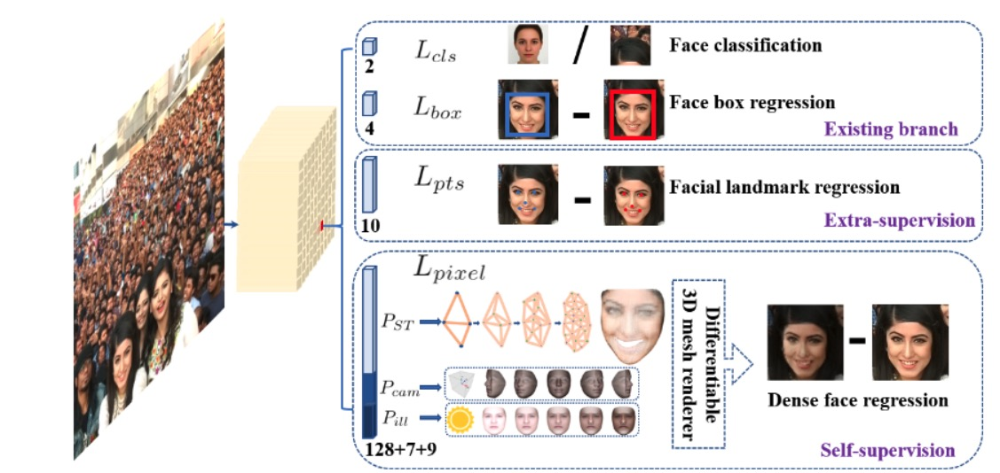

<div align="center">
  
</div>
<h4 align="center">
    <a href=#RetinaFace模型介绍> 模型介绍 </a> |
    <a href=#快速使用> 快速使用 </a> |
    <a href=#单图片推理> 单图片推理 </a> | 
    <a href=#多图片推理和评测> 多图片推理/评测 </a> 
</h4>

# RetinaFace模型介绍
RetinaFace为当前学术界和工业界精度较高的人脸检测和人脸关键点定位二合一的方法，被CVPR 2020 录取([论文地址](https://arxiv.org/abs/1905.00641), [代码地址](https://github.com/biubug6/Pytorch_Retinaface)))，该方法的主要贡献是:
- 引入关键点分支，可以在训练阶段引入关键点预测分支进行多任务学习，提供额外的互补特征，inference去掉关键点分支即可，并不会引入额外的计算量。

## 快速使用

在这个界面中，我们提供几个有关`推理/评测`脚本帮助大家迅速/一键使用RetinaFace, 代码范例中的实例均集成在test_retina_face_detection.py
- `Usage`:
```python
PYTHONPATH=. python face_project/face_detection/RetinaFace/test_retina_face_detection.py
```

## 代码范例

### 单图片推理
```python
import cv2
from modelscope.pipelines import pipeline
from modelscope.utils.constant import  Tasks

model_id = 'damo/cv_resnet50_face-detection_retinaface'
face_detection = pipeline(task=Tasks.face_detection, model=model_id)
# 支持 url image and abs dir image path
img_path = 'https://modelscope.oss-cn-beijing.aliyuncs.com/test/images/face_detection2.jpeg' 
result = face_detection(img_path)

# 提供可视化结果
from modelscope.utils.cv.image_utils import draw_face_detection_result
from modelscope.preprocessors.image import LoadImage
img = LoadImage.convert_to_ndarray(img_path)
cv2.imwrite('srcImg.jpg', img)
img_draw = draw_face_detection_result('srcImg.jpg', result)
import matplotlib.pyplot as plt
plt.imshow(img_draw)
```

### 多图片推理和评测
- 我们提供了100张测试图片，可运行下面代码一键使用（下载数据集+推理）；
- 也支持测试自建数据集，需要按如下格式建立数据集:
```
img_base_path/
    val_data/
        test_1.jpg
        ...
        test_N.jpg
    val_label.txt 
    ## val_label.txt format
    test_1.jpg
    x0 x1 w h 
    x0 x1 w h 
    ...
    test_N.jpg
    x0 x1 w h 
    x0 x1 w h 
    ...
```

```python
import os.path as osp
import cv2
import os
import numpy as np
from modelscope.msdatasets import MsDataset
from modelscope.pipelines import pipeline
from modelscope.utils.constant import Tasks
from modelscope.utils.cv.image_utils import voc_ap, image_eval,img_pr_info, gen_gt_info, dataset_pr_info, bbox_overlap

model_id = 'damo/cv_resnet50_face-detection_retinaface'
val_set = MsDataset.load('widerface_mini_train_val', namespace='ly261666', split='validation')#, download_mode=DownloadMode.FORCE_REDOWNLOAD)
img_base_path = next(iter(val_set))[1]
img_dir = osp.join(img_base_path, 'val_data')
img_gt = osp.join(img_base_path, 'val_label.txt')
gt_info = gen_gt_info(img_gt)
pred_info = {}
iou_th = 0.5
thresh_num = 1000
face_detection_func = pipeline(Tasks.face_detection, model=model_id, conf_th=0.01)
count_face = 0
pr_curve = np.zeros((thresh_num, 2)).astype('float')
for img_name in os.listdir(img_dir):
    print ('inference img: {} {}/{}'.format(img_name, idx+1, len(os.listdir(img_dir))))
    abs_img_name = osp.join(img_dir, img_name)
    result = face_detection_func(abs_img_name)
    pred_info = np.concatenate([result['boxes'], np.array(result['scores'])[:,np.newaxis]], axis=1)
    gt_box = np.array(gt_info[img_name])
    pred_recall, proposal_list = image_eval(pred_info, gt_box, iou_th)
    _img_pr_info, fp = img_pr_info(thresh_num, pred_info, proposal_list, pred_recall)
    pr_curve += _img_pr_info
    count_face += gt_box.shape[0]
    
pr_curve = dataset_pr_info(thresh_num, pr_curve, count_face)
propose = pr_curve[:, 0]
recall = pr_curve[:, 1]
for srecall in np.arange(0.1, 1.0001, 0.1):
    rindex = len(np.where(recall<=srecall)[0])-1
    rthresh = 1.0 - float(rindex)/thresh_num
    print('Recall-Precision-Thresh:', recall[rindex], propose[rindex], rthresh)
ap = voc_ap(recall, propose)
print('ap: %.5f, iou_th: %.2f'%(ap, iou_th))
```
Result:
```
Recall-Precision-Thresh: 0.09981466772570824 0.9973544973544973 0.979
Recall-Precision-Thresh: 0.19962933545141648 0.989501312335958 0.855
Recall-Precision-Thresh: 0.2994440031771247 0.9576629974597799 0.486
Recall-Precision-Thresh: 0.3995234312946783 0.7038246268656716 0.11099999999999999
Recall-Precision-Thresh: 0.4980142970611596 0.3608286974870516 0.029000000000000026
Recall-Precision-Thresh: 0.5837966640190627 0.17127543886903837 0.0010000000000000009
Recall-Precision-Thresh: 0.5837966640190627 0.17127543886903837 0.0010000000000000009
Recall-Precision-Thresh: 0.5837966640190627 0.17127543886903837 0.0010000000000000009
Recall-Precision-Thresh: 0.5837966640190627 0.17127543886903837 0.0010000000000000009
Recall-Precision-Thresh: 0.5837966640190627 0.17127543886903837 0.0010000000000000009
ap: 0.45492, iou_th: 0.50
```

## 模型精度


## 引用
如果你觉得这个该模型对有所帮助，请考虑引用下面的相关的论文：

```BibTeX
@inproceedings{deng2020retinaface,
      title={Retinaface: Single-shot multi-level face localisation in the wild},
        author={Deng, Jiankang and Guo, Jia and Ververas, Evangelos and Kotsia, Irene and Zafeiriou, Stefanos},
          booktitle={Proceedings of the IEEE/CVF conference on computer vision and pattern recognition},
            pages={5203--5212},
              year={2020}
}
```

